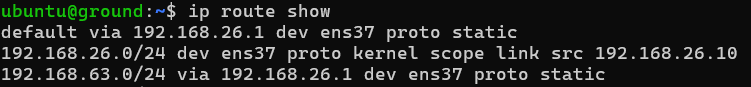

# 🌐 Network Configuration

## 📌 Overview
This document details the network setup that I used. The **Router VM** acts as a gateway between **Ground (192.168.26.10)** and **Spacecraft (192.168.63.10)**, ensuring that all traffic passes through it.

## 📁 Network Configuration

| VM Name        | Interface  | IP Address       | Role |
|---------------|-----------|-----------------|------|
| **Router**     | `ens33`   | `192.168.32.141/24 (NAT)` | Internet Access |
|               | `br0`     | `192.168.26.1/24` | Bridge for Ground |
|               | `br0`     | `192.168.63.1/24` | Bridge for Space |
| **Ground**     | `ens37`   | `192.168.26.10/24` | Connected to Router |
| **Spacecraft** | `ens37`   | `192.168.63.10/24` | Connected to Router |

## 🔄 Routing Table
```bash
ip route
Below is the routing table for the Ground VM:


